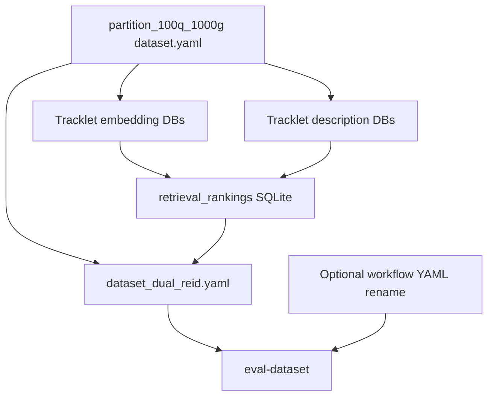

# Plan: MARS person ReID eval (full session plan)

This document captures the plan agreed in-session: **partition shape**, **protocol fidelity**, **workflow/path strategy**, **full-vs-subset comparison**, and **phased scope** (partition first; precompute + eval later).

---

## Overview

**Goal:** Run the existing **dataset-eval ReID workflow** (four-path precomputed fusion: Torchreid + FastReID + two description channels → weighted RRF → `ranked_gallery_ids`) on **MARS**, using **tracklets** as retrieval units and standard **mAP / CMC** scoring.

**Phasing:**

| Phase | Scope |
|-------|--------|
| **1 — Partition** | Build `dataset.yaml` + copied middle-frame images + `partition_stats.json`. **No** embedding DBs, retrieval SQLite, or `eval-dataset`. |
| **2 — Precompute** | Tracklet embedding DBs, description DBs, `retrieval_rankings` SQLite (four channels). |
| **3 — Eval** | `dataset_dual_reid.yaml`, `dataset_eval.yaml`, `eval-dataset`; optional **workflow YAML rename** (see below). |

---

## Partition specification (Phase 1)

### Fixed sizes

- **100 query tracklets** × **1000 gallery tracklets** (shared gallery list per row, same pattern as Market-1501 [`build_partition`](evals/person_reid_market1501/build_partition.py)).
- Output directory convention: e.g. `evals/person_reid_mars/partition_100q_1000g/`.

### Official MARS test protocol (fidelity)

Follow **Torchreid `mars.py`** / official evaluation metadata:

- **`info/tracks_test_info.mat`** → variable `track_test_info`, shape `(num_tracklets, 4)`: `[start_index, end_index, pid, camid]` indexing **`info/test_name.txt`** (MATLAB-style bounds; Torchreid slices `names[start_index - 1:end_index]`).
- **`info/query_IDX.mat`** → query row indices into `track_test_info` (**subtract 1** from MATLAB indices for 0-based rows).
- **Gallery pool:** all test tracklet rows **not** listed in `query_IDX` (official complement).

Skip junk identities **`pid ∈ {-1, 0}`** for eligibility where applicable.

### Sampling (aligned with Market partition intent)

1. **Eligible queries:** official query tracklets that have **≥ 1** gallery tracklet with **same `pid`** and **different `camid`** (cross-camera positive).
2. Sample **`n_queries`** (100) from eligible set with fixed **seed**.
3. Build **shared gallery** of size **`gallery_size`** (1000):
   - For each selected query, add **one random** cross-camera positive from the gallery pool (dedupe by tracklet id).
   - Fill remaining slots with random distinct gallery tracklets until size reached.

### Representative image per tracklet

- For **every** tracklet used as query or gallery: use the **middle frame** of that tracklet’s frame list: index **`(num_frames - 1) // 2`** within the slice defined by `tracks_test_info`.
- Materialize copies under the partition folder (`query/`, `bounding_box_test/`) named by stable tracklet ids (`mars_{track_test_row_index:05d}`), preserving original filename suffix where applicable.

### Row schema (`dataset.yaml`)

YAML **list of dicts** (see [`backend/evals/dataset.py`](backend/evals/dataset.py)). Each row matches the Market partition shape:

- `query_id`, `query_image_path`, `query_embedding_db_path`, `query_description_db_path`
- `gallery_embedding_db_path`, `gallery_description_db_path`
- `retrieval_top_k`
- `query_pid`, `query_camid`
- `gallery_ids`, `gallery_pids`, `gallery_camids` — **parallel lists**, fixed length **1000** per row

Placeholder DB paths point under **`evals/person_reid_mars/`** (embedding + description dirs) for the next phase.

### Full protocol vs subset (`partition_stats.json`)

Emit **counts and notes**:

- **Full:** `num_test_tracklets`, `num_query_tracklets_official` (from `query_IDX`), `num_gallery_tracklets_official` (complement size).
- **This partition:** `n_queries` (100), `gallery_size` (1000), **seed**, eligible-query count, selected counts.

---

## Existing workflow and paths

### Eval workflow graph

The eval graph [`workflows/person_reid_market1501_eval.yaml`](workflows/person_reid_market1501_eval.yaml) is **dataset-agnostic at runtime**: SQLite lookups + fusion into `ranked_gallery_ids`. Tags/name still say Market-1501.

### Dataset eval harness

- Config pattern: [`evals/person_reid_market1501/dataset_eval.yaml`](evals/person_reid_market1501/dataset_eval.yaml) — `input_mapping` + `map_cmc` scorer on `final_state.ranked_gallery_ids` vs `row.gallery_*` / `row.query_*`.
- Runner: `python -m backend.cli.main eval-dataset <workflow_name> --config <dataset_eval.yaml>`
- Artifacts: `runs/evals/<workflow>/<eval_id>/`

### Keeping vs changing paths

**Keep:**

- Workflow **graph** (nodes/edges) and tools in [`backend/tools/reid_specialists.py`](backend/tools/reid_specialists.py).
- Generic dataset eval + `map_cmc` logic in [`backend/evals/dataset.py`](backend/evals/dataset.py).

**Do not reuse for MARS artifacts:**

- Market-specific generated paths under `evals/person_reid_market1501/partition_*` or Market-named retrieval SQLite files — use **MARS-specific** outputs under `evals/person_reid_mars/` to avoid collisions.

### Workflow rename (defer to eval phase)

When wiring MARS eval, **rename** the workflow file + graph `name:` to something dataset-neutral (e.g. `person_reid_precomputed_fusion_eval`) and update references/tests. **Not required** for partition-only work.

---

## Phase 2 — Precompute (later)

1. **Embedding SQLite** (`image_embeddings`): Torchreid / FastReID channels per tracklet id (middle-frame or agreed rule — **aligned with partition ids**).
2. **Description SQLite** (semantic + facets) — same id keys.
3. **`build_reid_retrieval_score_db`-style** ranking DB: [`evals/person_reid_market1501/build_reid_retrieval_score_db.py`](evals/person_reid_market1501/build_reid_retrieval_score_db.py) pattern → `retrieval_rankings` table + channel names (`VISUAL_TORCHREID_CHANNEL`, etc.).
4. **`build_reid_eval_datasets.py`** pattern → `dataset_dual_reid.yaml` adding `retrieval_score_db_path`, `retrieval_score_top_k`, channel strings, `fusion_weight_config`.

---

## Phase 3 — Eval (later)

1. Add **`evals/person_reid_mars/dataset_eval.yaml`** pointing at `dataset_dual_reid.yaml` (reuse `input_mapping` / scorers from Market eval config).
2. Run:

```bash
python -m backend.cli.main eval-dataset person_reid_market1501_eval \
  --config evals/person_reid_mars/dataset_eval.yaml
```

(After rename, substitute the new workflow name.)

3. Validate **`failed_rows.jsonl`** for missing DB channels before trusting aggregate metrics.

---

## Deferred execution flow (end-to-end)



---

## Validation checklist

### Partition (Phase 1)

- [ ] YAML is a **list** of **dict** rows.
- [ ] Every row: `len(gallery_ids) == len(gallery_pids) == len(gallery_camids) == 1000`.
- [ ] Queries ⊆ official **`query_IDX`** rows; gallery pool = official complement.
- [ ] Each query has ≥ 1 cross-camera positive in the sampled gallery (when eligible pool allows).
- [ ] `query_image_path` uses **middle frame** of the query tracklet.

### Precompute + eval (later)

- [ ] Every `query_id` present in retrieval DB for **all four** channels.
- [ ] `map_cmc` junk rules consistent with `query_camid` / `gallery_camids` ([`map_cmc_filtered_ranked_pairs`](backend/evals/dataset.py)).

---

## Commands reference

### Partition only (implemented)

```bash
python3 evals/person_reid_mars/build_partition.py \
  --mars-root dataset/mars \
  --output-dir evals/person_reid_mars/partition_100q_1000g \
  --n-queries 100 \
  --gallery-size 1000 \
  --seed 42
```

Requires local MARS tree: **`dataset/mars`** with `bbox_test/` and `info/` (see root [`dataset.md`](dataset.md)).

---

## Citations / references

- MARS benchmark: Zheng et al., ECCV 2016.
- Split logic aligned with **Torchreid** `torchreid/data/datasets/video/mars.py`.
- Repo dataset layout: [`dataset.md`](dataset.md).
